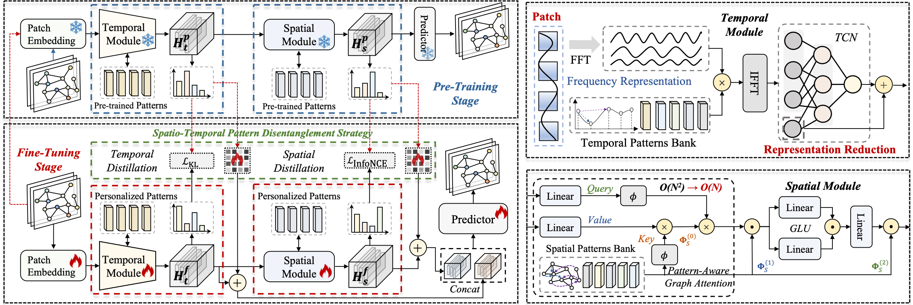
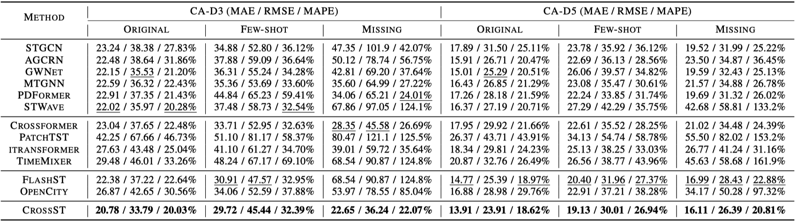

<div align="center">
  <h1><b> [ICDE'25] ✨ CrossST: An Efficient Pre-Training Framework for Cross-District Pattern Generalization in Urban Spatio-Temporal Forecasting</b></h1>
  
</div>


If you find this repository helpful for your work, please consider giving a star ⭐ and citation 📚:
> ```LaTeX
> @inproceedings{CrossST,
>  title={CrossST: An Efficient Pre-Training Framework for Cross-District Pattern Generalization in Urban Spatio-Temporal Forecasting},
>  author={Aoyu Liu and Yaying Zhang},
>  booktitle={ICDE},
>  year={2025},
> }
> ```

# 📊 Datasets
The dataset utilized in this experiment is derived from the open-source dataset [LargeST](https://github.com/liuxu77/LargeST). Notably, while LargeST offers data spanning a five-year period, we selected only data from a specific time frame for our analysis. The datasets involved in the experiment are available [here](https://drive.google.com/drive/folders/12wMQW9EcCUoCTDB7ZmNZNnqQ4UWS0y7K?usp=sharing). We extend our sincere gratitude to the authors of the referenced datasets.

# 🚀 Quick Start
It's easy to run! Here are some examples, and you can customize the model settings in train.py.
## Pre-Training
```
nohup python -u pre_train.py --d_model 256 --device cuda:0 > pre_train.log &
```
## Fine-Tuning
If you want to perform fine-tuning on CA-D5:
```
nohup python -u fine_tuning.py --data CAD5 --d_model 64 --device cuda:0 > fine_tuning-CAD5.log &
```
```
nohup python -u fine_tuning.py --data CAD5_10 --d_model 32 --device cuda:0 > fine_tuning-CAD5_10.log &
```

# 🎯 Results
<p align="center">
  
</p>
<p align="center">
  
</p>

# 🔗 Acknowledgement
We greatly appreciate the following GitHub repositories for their valuable code, data, and contributions.
- [EAC](https://github.com/liuxu77/LargeST)
- [BasicTS](https://github.com/GestaltCogTeam/BasicTS)
